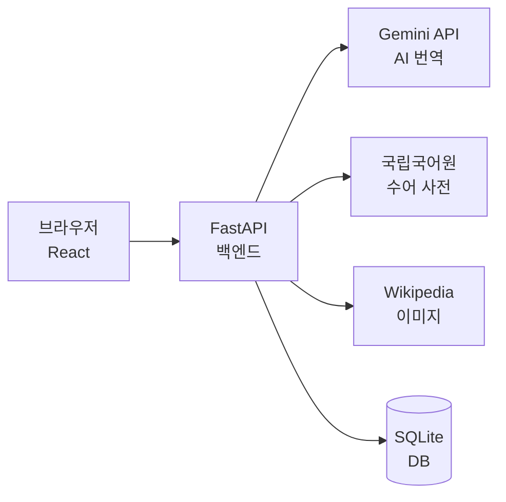

# 수다 _ [수다手多](https://2024136033hub.github.io/App_programing_apply-Week11-/presentation/)

> 청각장애인을 위한 AI 기반 한국어 수어(KSL) 실시간 번역 플랫폼

한국 청각장애인 약 40만 명의 일상 소통 장벽을 해소하기 위해,
웹캠 수어 인식과 텍스트 직접 입력 두 가지 방식으로 자연스러운 한국어 문장을 생성합니다.


---

## 주요 기능

- **웹캠 실시간 번역** — Gemini Vision AI가 3초마다 수어 동작을 인식하여 한국어 문장으로 변환
- **텍스트 직접 입력** — 수어 단어 검색 → 국립국어원 수어 사전 + Wikipedia 이미지 → 자연어 변환
- **회원가입/로그인** — 이메일 기반 계정 관리 (JWT 인증)
- **번역 기록** — 로그인 시 번역 내역 자동 저장·조회·삭제

---

## 기술 스택

| 영역 | 기술 |
|------|------|
| 프론트엔드 | React 19 + Tailwind CSS (Vite) |
| 상태 관리 | useState + Context API |
| 백엔드 | Python FastAPI |
| AI | Gemini API (gemini-2.0-flash) |
| 데이터베이스 | SQLite (SQLAlchemy) |
| 인증 | JWT (python-jose) |
| 수어 사전 | 국립국어원 통합수어정보 API |
| 명사 이미지 | Wikipedia API |

---

## 아키텍처



자세한 내용 → [docs/architecture.md](docs/architecture.md)

---

## 빠른 시작

```bash
# 백엔드
cd backend
pip install -r requirements.txt
uvicorn app.main:app --reload --port 8000

# 프론트엔드 (새 터미널)
cd frontend
npm install
npm run dev
```

자세한 환경 설정 → [docs/setup.md](docs/setup.md)

---

## 의사결정 기록 (ADR)

| ADR | 결정 |
|-----|------|
| [ADR-0001](.planning/decisions/ADR-0001-mobile-framework.md) | 모바일 프레임워크: React Native |
| [ADR-0002](.planning/decisions/ADR-0002-state-management.md) | 상태 관리: useState + Context API |
| [ADR-0003](.planning/decisions/ADR-0003-backend-choice.md) | 백엔드: FastAPI |

---

## 문서

- [환경 설정](docs/setup.md)
- [배포 가이드](docs/deploy.md)
- [테스트](docs/testing.md)
- [아키텍처](docs/architecture.md)
- [AI Agent 활용](AGENTS.md)
- [가산점 신청](BONUS.md)

---

## 만든 사람

2024136033 | 앱프로그래밍 응용 | 2026년 1학기
