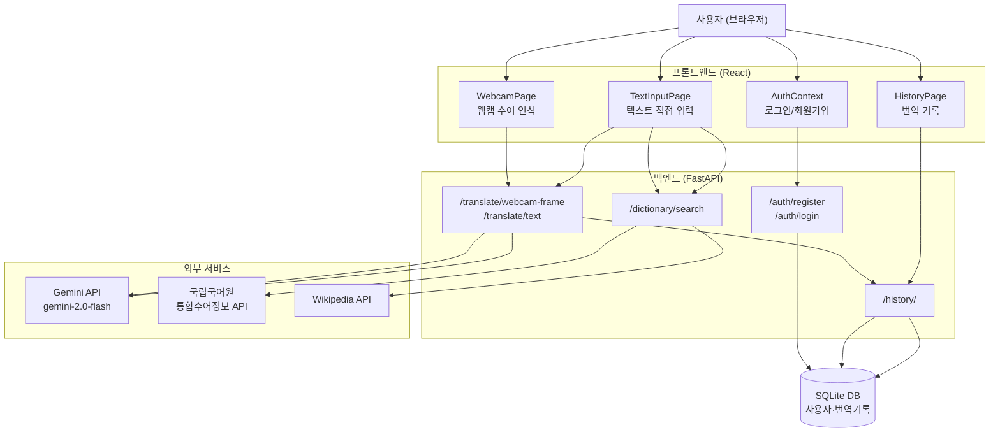

# 시스템 아키텍처

## 한 줄 요약

청각장애인이 수어로 표현하면 Gemini AI가 인식하고 자연스러운 한국어 문장으로 변환하는 웹 플랫폼.

---

## 레이어 구성

| 레이어 | 기술 | 역할 |
|--------|------|------|
| 프론트엔드 | React 19 + Tailwind CSS (Vite) | UI, 웹캠 접근, 사용자 입력 |
| 상태 관리 | useState + Context API | 인증 상태(AuthContext), 페이지별 로컬 상태 |
| 백엔드 | Python FastAPI | API 라우팅, 외부 API 호출, 인증, DB |
| AI 엔진 | Gemini API (gemini-2.0-flash) | 수어 인식(Vision), 자연어 문장 변환 |
| 수어 사전 | 국립국어원 통합수어정보 API | 수어 후보 단어 + 동작 영상/이미지 |
| 명사 이미지 | Wikipedia API | 명사 검색 시 대표 이미지 |
| 데이터베이스 | SQLite (SQLAlchemy) | 회원 정보, 번역 기록 저장 |

---

## 전체 흐름 다이어그램



---

## 번역 방식별 데이터 흐름

### 방식 1 — 웹캠 실시간 인식
```
브라우저 웹캠 → 3초마다 프레임 캡처 → base64 인코딩
→ POST /translate/webcam-frame
→ Gemini Vision API (이미지 분석 → 수어 단어 인식)
→ 단어 시퀀스 누적
→ POST /translate/text (단어 시퀀스 → 자연어 문장)
→ 화면에 자막 출력 + 번역 기록 자동 저장
```

### 방식 2 — 텍스트 직접 입력
```
사용자 단어 입력
→ GET /dictionary/search (국립국어원 API → 수어 후보 목록)
→ Wikipedia API (명사 이미지)
→ 사용자가 수어 선택 → 단어 시퀀스 구성
→ POST /translate/text (Gemini API → 자연어 문장)
→ 화면 출력 + 번역 기록 자동 저장
```

---

## 디렉토리 구조

```
project_3-1-2/
├── frontend/               # React (Vite)
│   └── src/
│       ├── pages/          # Home, WebcamPage, TextInputPage, HistoryPage, LoginPage, SignupPage
│       ├── components/     # Header, Footer, SubtitleDisplay, LoadingSpinner, ErrorMessage
│       ├── contexts/       # AuthContext (useState + Context API)
│       └── services/       # api.js (백엔드 통신)
├── backend/                # FastAPI
│   └── app/
│       ├── routers/        # translate, dictionary, auth, history
│       ├── services/       # gemini.py, sign_dictionary.py, wikipedia.py
│       ├── models.py       # SQLAlchemy User, History
│       ├── schemas.py      # Pydantic 스키마
│       ├── auth.py         # JWT 인증
│       └── database.py     # SQLite 연결
├── planning/               # 기획 문서
│   └── decisions/          # ADR-0001~0003
└── docs/                   # 개발 문서
```

---

## 핵심 의사결정 요약

| 결정 | 선택 | 근거 |
|------|------|------|
| 모바일 프레임워크 | React Native | 웹 코드 재사용, JS 단일 스택 → [ADR-0001](../planning/decisions/ADR-0001-mobile-framework.md) |
| 상태 관리 | useState + Context API | 외부 패키지 불필요, 규모에 적합 → [ADR-0002](../planning/decisions/ADR-0002-state-management.md) |
| 백엔드 | FastAPI | Gemini Python SDK 최적, async 지원 → [ADR-0003](../planning/decisions/ADR-0003-backend-choice.md) |
| 수어 인식 | Gemini Vision API | KSL 학습 데이터 부족으로 LSTM → Gemini Vision 전환 |
