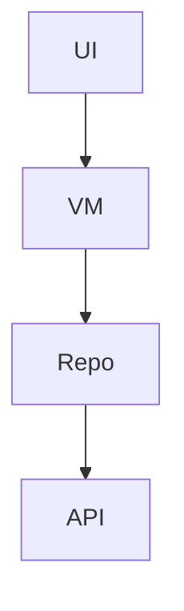

# README 템플릿

```markdown
# [프로젝트명]

> [한 줄 가치 제안 — 누구의 어떤 문제를 어떻게 푸는가]

[]()
[]()
[]()

## 데모


또는 [데모 영상 (1분)](docs/assets/demo.mp4)

## 주요 기능

- ✨ [기능 1]
- 🎯 [기능 2]
- 🔒 [기능 3]

## 기술 스택

| 영역 | 사용 기술 |
|---|---|
| 프레임워크 | [Flutter / RN / Kotlin / Swift] |
| 상태관리 | ... |
| 백엔드 | ... |
| 테스트 | ... |
| 배포 | ... |

## 아키텍처



자세한 내용 → [docs/architecture.md](docs/architecture.md)

## 빠른 시작

```bash
git clone https://github.com/[user]/[repo].git
cd [repo]
[install]
[run]
```

자세한 환경 설정 → [docs/setup.md](docs/setup.md)

## 빌드 / 배포

[docs/deploy.md](docs/deploy.md)

## 테스트

```bash
[test command]
```

자세한 내용 → [docs/testing.md](docs/testing.md)

## 프로젝트 구조

```
src/
├── presentation/
├── application/
├── domain/
└── data/
```

## 의사결정 로그

`.planning/decisions/` 참고

## 라이선스

MIT (또는 본인 선택)

## 만든 사람

[이름] · [GitHub] · [선택: 이메일]
```

## 작성 팁

- README는 **최상단 한 화면**이 가장 중요
  - 한 줄 설명, 데모 이미지/영상, 주요 기능까지
- 스크린샷은 실제 동작 화면
- 배지(shields.io)는 적당히 — 너무 많으면 산만
